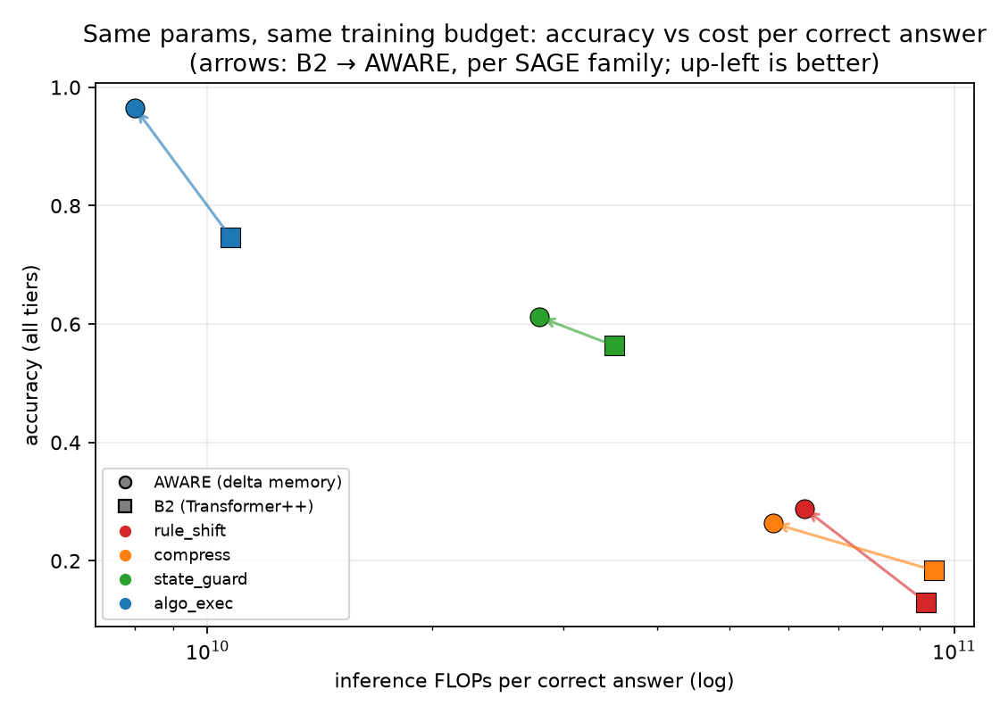

# Aware — when does latent depth pay?

**An honest-FLOP architecture study at 15–50M parameters, run by an autonomous
research-agent loop for ~$38 of cloud compute. Negative results included.**

Aware tests whether small language models can buy reasoning through *latent
computation* — recurrent depth (loops) and fast-weight memory (gated delta-rule
layers) — instead of only through more parameters, more tokens, and longer
chain-of-thought. Every comparison is matched on parameters, data, and training
FLOPs; every claim is pre-registered before results exist and traces to a
`run_id` in `experiments/results.csv`.

**Full write-up: [`reports/arc1_latent_depth.md`](reports/arc1_latent_depth.md)**

## Headline results (8 pre-registered experiments)

1. **Loops never paid.** Weight-tied recurrent depth loses at matched training
   FLOPs — vanilla (EXP-001B) *and* with the 2026 recipe (per-loop supervision,
   randomized loop counts: EXP-003/003B). The recipe models silently learned to
   ignore their own loops; a pre-registered K-gap diagnostic caught it twice.
2. **Writable memory paid, broadly.** Replacing every 2nd attention layer with
   a gated delta-rule fast-weight layer ("AWARE", 17.86M) beats a param-matched
   Transformer++ on **5/5 SAGE families** — and each correct answer costs
   **20–40% fewer inference FLOPs**:



3. The advantage is **attributed** (2×2 ablation: delta mechanism +22.8 pts,
   sliding-window +3.5) and **budget-robust** (doubling the baseline's training
   budget leaves a +25.8 pt gap on hard tiers). At 50M under a fixed recipe the
   picture is honestly mixed: the computation gap grows (+31.7), the
   state-tracking gap reverses (−5.2).
4. **Anomaly:** bimodal skill acquisition — 1 in 6 seeds jumps discontinuously
   from ~14% to 100% on rule_shift (0/6 for the baseline).

## Try it (2 minutes)

```powershell
python scripts/demo.py --family algo_exec --n 8 --difficulty 3
```

Generates 8 fresh puzzles (seeds far outside the training range) and runs both
models side by side with a live FLOPs-per-correct meter. Typical output: AWARE
8/8 vs B2 5/8, with the closing line *"each correct answer costs B2 1.66x what
it costs AWARE."* Demo checkpoints are attached to the GitHub release (place
them in `checkpoints/`), or retrain the pair in ~40 min on one GPU with
`experiments/configs/exp002_algo_exec.yaml`.

## Layout

```
docs/         CONCEPT, BENCHMARK (SAGE spec), AGENT, BASELINES, PLAN
sage/         benchmark generators, scoring, contamination audit, FLOP accounting
models/       GPT-2 baseline, Transformer++, loop-core variant, delta-memory variant
train/        shared training loop, data pipeline, byte tokenizer
eval/         evaluation harness, reports
agent/        hypothesis backlog, experiment logs (pre-registrations), decision policy
experiments/  configs (frozen by hash) + results.csv (source of truth, 1300+ rows)
reports/      arc-1 report + figures
scripts/      make_data, train, eval, demo, adjudicators, cloud pod runners
tests/        scorer/generator/FLOP correctness tests (87, run before any logging)
```

## Reproduce

```powershell
python -m venv .venv
.\.venv\Scripts\python -m pip install -r requirements.txt
python scripts/make_data.py --split train --per-family 20000 --families algo_exec
python scripts/make_data.py --split eval  --per-family 400   --families algo_exec
python -m pytest tests/ -q                     # 87 tests must pass
python -m sage.contamination.audit --train-dir data/sage/train --eval-dir data/sage/eval
python scripts/run_exp.py --config experiments/configs/exp002_algo_exec.yaml --workers 2
python scripts/adjudicate_exp002.py            # verdict vs pre-registered margins
```

Cloud runs use the pod scripts in `scripts/cloud/` (RunPod, single RTX 5090;
every session auto-stops via a sentinel + watcher pair). The full experiment
sequence and verdicts live in `agent/log/EXP-*.md`.

## Rules of evidence

Margins pre-registered in `agent/log/` before any results; baselines frozen by
config hash; train/eval seed ranges disjoint at import level; contamination
audit before every training job; analytic FLOP accounting cross-checked against
PyTorch's counter in CI; CoT tokens are never free; deviations logged at
decision time. Negative results get full write-ups.

## License

MIT — see [LICENSE](LICENSE).
