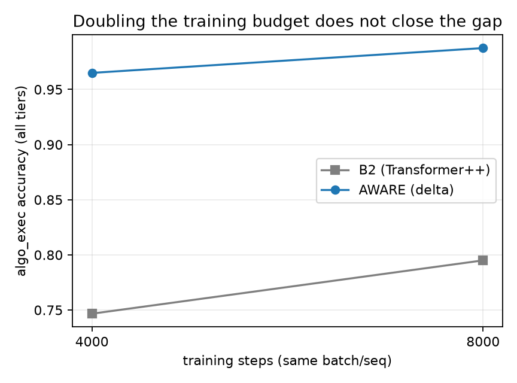

# When does latent depth pay? An honest-FLOP study at 18M parameters

**Arc 1 report — aware-research-3 · 2026-07-06 · status: COMPLETE (8 experiments, ~$38 total cloud spend)**

Reproduce the demo: `python scripts/demo.py --family algo_exec --n 8 --difficulty 3` (fresh puzzles, seeds outside the training range; typical result: AWARE 8/8 vs B2 5/8, each correct answer costing B2 ~1.7x more FLOPs).

## TL;DR

At matched parameters (±0.3%), matched data, and matched (or baseline-favoring)
training budgets, on a contamination-audited procedural benchmark (SAGE):

1. **Recurrent latent depth (loops) never paid.** Vanilla loops lose at matched
   training FLOPs; the 2026 training recipe (per-loop supervision, randomized
   loop counts, TBPTT) produced *loop-invariant* models twice — models that
   ignore their own iterations (K-gap < 2 pts against a pre-registered 5-pt
   gate). Three strikes, timebox exhausted, hypothesis parked.
2. **Fast-weight memory (gated delta-rule layers) paid, broadly.** The hybrid
   ("AWARE", 17.86M) beats a param-matched Transformer++ on **all five** SAGE
   families at 18M — and delivers each correct answer **20–40% cheaper** in
   inference FLOPs. At 50M (fixed recipe) the picture is honestly mixed:
   the computation gap grows (+31.7), the state-tracking gap reverses (−5.2).
3. The advantage is **attributed** (2×2 ablation: it is the delta mechanism,
   +22.8, not the sliding-window attention, +3.5) and **budget-robust**
   (doubling the baseline's training budget leaves a +25.8 gap on hard tiers).
4. Anomaly worth its own study: on one family, the memory model shows
   **bimodal skill acquisition** — 1 seed in 6 jumps discontinuously from ~14%
   to 100% accuracy (0/6 for the baseline).

Every number traces to `experiments/results.csv` run_ids; every experiment was
pre-registered (margins fixed before results) in `agent/log/EXP-*.md`.

## Setup

- **Benchmark:** SAGE — procedural families with generated instances,
  difficulty tiers 1–5, execution-checked scoring, n-gram/near-dup
  contamination audit per run. Families used here: `algo_exec` (program
  execution), `rule_shift` (rules change mid-session), `compress`
  (in-session codebook learning), `state_guard` (state tracking),
  `dsl_learn` (fresh mini-language induction; pending).
- **Models** (byte-level, vocab 259, all trained from scratch, per-family):
  - `B2` — Transformer++ (RoPE, SwiGLU, RMSNorm, GQA): the reference opponent.
  - `V1/V1R` — B2 blocks in a prelude/loop/coda topology (latent depth).
  - `AWARE (V2/V3)` — B2 blocks with every 2nd attention layer replaced by a
    **gated delta-rule fast-weight layer** (linear-attention family;
    writable memory updated token-by-token) + sliding-window attention (w=128)
    on the remaining layers. 17.86M vs B2's 17.83M (+0.1%).
- **Accounting:** analytic FLOP counts cross-checked against PyTorch's counter
  in CI; loops charged per executed iteration; every generated token charged a
  full forward pass; reported metric: **inference FLOPs per correct answer**.

## Result 1 — loops don't pay (and the diagnostic that saved us)

| experiment | question | outcome |
|---|---|---|
| EXP-001/001B | loop4 vs loop1, equal params AND matched training FLOPs | equal-params: +9.8 on rewrite (5/6 seeds); matched-FLOPs: gain vanishes; 2.5× inference cost | 
| EXP-003 | 2026 recipe (per-loop supervision, randomized K, TBPTT) | **instrument-fail:** K-gap < 1 pt — the model ignores its loops |
| EXP-003B | + step embeddings, detached weighted readouts, bptt 4 | K-gap ~ +1.5 pts, still far under the 5-pt gate; loses to own controls |

The pre-registered **K-gap gate** (evaluate the same checkpoint at K=1 vs K=4;
require > 5 pts) caught both recipe attempts silently converging to
loop-invariant solutions — the "readout blind spot" predicted by
arXiv:2606.24898. Without this gate we would have reported loop results from
models that never used their loops. Scope note: latent iteration has real wins
in continuous-output domains (e.g. robotics VLAs); symbolic text — where
explicit CoT is strongest — is its hardest venue, and that is where we tested.

Residual finding that survives: loops are **parameter-efficient** (not
FLOP-efficient) — relevant to memory-bound deployment, nothing else.

## Result 2 — writable memory pays, broadly and cheaply

18M head-to-head, all-tier accuracy (mean over seeds) and inference cost:

| family | B2 acc | AWARE acc | Δ | B2 FLOPs/correct | AWARE FLOPs/correct |
|---|---|---|---|---|---|
| algo_exec | .747 | **.965** | +21.8 | 1.07e10 | **8.0e9** |
| state_guard | .563 | **.612** | +4.8 | 3.51e10 | **2.79e10** |
| compress | .184 | **.263** | +7.9 | 9.40e10 | **5.73e10** |
| rule_shift (6 seeds) | .130 | **.288** | +15.8 | 9.18e10 | **6.3e10** |
| dsl_learn (2 seeds) | .165 | **.205** | +4.0 | — | 4.18e10 |

5/5 families at 18M.

Up-left is better on both axes: AWARE dominates the baseline on **every
family** — more correct answers, each one cheaper.

### Attribution (EXP-006): it's the memory, not the window

AWARE differs from B2 in two ways, so we completed the 2×2 on algo_exec:

| | full attention | SWA-128 |
|---|---|---|
| **no delta** | B2 .747 | B2-SWA .782 |
| **delta** | V2-full **.975** | AWARE .965 |

Delta effect **+22.8**; window effect **+3.5**; and B2-SWA reproduces *none*
of the memory-family gains (state_guard actually degrades, −4.1). A
pre-registered prediction was falsified here, worth reporting: we expected the
window to explain the FLOP discount; in fact the efficiency edge is also
delta-driven (via the accuracy denominator — the window trims only ~7%).

### Budget robustness (EXP-007): not a fast-learner artifact

The sharpest objection: maybe delta layers just *optimize faster*, and the
baseline catches up with more training. We doubled the budget (8000 steps):

B2 improves (.747 → .795) — the arm discriminates — but on the non-saturated
difficulty tiers (3–5) the gap **remains +25.8 pts** (pre-registered pass bar:
retain half of the 4000-step gap). The advantage is a property of the
architecture, not of early training dynamics, at this scale.

### Semantics, stated carefully

The pre-registered "memory-specific" dissociation (rule_shift gain must exceed
algo_exec gain) passed only on a technicality driven by one grokked seed. The
honest claim is **broader, not weaker**: the delta layers are a better generic
sequence-computation component at this scale — on memory-flavored AND
computation-flavored tasks — rather than a narrowly "memory-task" device.

## Result 3 — bimodal skill acquisition (anomaly, logged for arc 2+)

rule_shift, 6 seeds each: AWARE seeds land at
.140/.130/**1.000**/.145/.170/.145 — five seeds show a small consistent edge,
one seed transitions discontinuously to perfect accuracy (train loss 0.0014).
B2: 0/6 such transitions. Same data, same config, different init. Checkpoints
for all six AWARE seeds are retained (`checkpoints_grok/`) for the follow-up
study (early-training predictors of the transition).

## Scale trend (EXP-008): task-dependent, honestly mixed

50.5M head-to-head (V3-50M vs B2-50M, −0.05% param match), 2 seeds, same
4000-step protocol (lr depth-scaled, not per-arm tuned):

| family | 18M gap | 50M gap | read |
|---|---|---|---|
| algo_exec | +21.8 | **+31.7** (tier 3–5: +33.4) | advantage grew |
| state_guard | +4.8 | **−5.2** | advantage reversed |

Interpretation, stated carefully: under a *fixed* training recipe, the
computation-flavored advantage scales and the state-tracking advantage does
not. A caveat cuts both ways — B2-50M underperforms B2-18M on algo_exec
(.665 vs .747) and both models drop on state_guard, so the 50M regime is
likely undertrained; part of the algo_exec gap growth is baseline weakness,
and the state_guard reversal may be a tuning artifact. Distinguishing
"task-dependent scaling" from "undertuned 50M recipe" requires a tuned-budget
rerun (parked). **No uniform-scaling claim is made.**

## Limitations (read before citing)

- 18–50M scale, byte-level, procedural benchmark; **no claim** about natural
  language or frontier scale. The mechanism family is independently validated
  at production scale by others (Gated DeltaNet lineage); our contribution is
  the controlled, matched, per-FLOP evidence chain, not the mechanism.
- Per-family training (specialists, not generalists) — a multi-task control is
  future work.
- One window size (128), one delta placement sweep (every 1/2/3 layers;
  every-2nd won); lr depth-scaled but not per-arm tuned.
- The delta scan implementation is sequential (correct, slow); wall-clock
  comparisons favor B2 (visible in the demo: ~350ms vs ~80ms per puzzle) and
  are reported nowhere as claims. FLOP counts are implementation-independent;
  chunked-parallel kernels for this layer family exist in production.
- rule_shift's bimodality means its mean gap (+15.8) is seed-distribution
  sensitive; the median gap is +2.5.

## Claim table (wired)

| claim | experiments | pre-reg | status |
|---|---|---|---|
| Vanilla loops don't pay per training FLOP | EXP-001B | agent/log/EXP-001B.md | KILLED H1 |
| Recipe loops (2026) don't engage at this scale | EXP-003, EXP-003B | agent/log/EXP-003.md | H3 PARKED (2× instrument-fail) |
| Delta hybrid beats matched B2 on 4/4 families | EXP-002, EXP-002-AX | agent/log/EXP-002.md | margin PASS; stability gate FAIL (rule_shift bimodality), EXTEND run |
| Advantage is delta-driven, not window-driven | EXP-006 | agent/log/EXP-006.md | PASS (interpretation 1) |
| Advantage survives 2× baseline training budget | EXP-007 | agent/log/EXP-007.md | PASS (tier 3–5 gap +25.8) |
| Best density = every 2nd layer | EXP-005-DEN | agent/log/EXP-005.md | d2 confirmed |
| dsl_learn extension (5th family) | EXP-002-DL | agent/log/EXP-002.md | +4.0 (2 seeds) |
| Advantage at 50M | EXP-008 | agent/log/EXP-008.md | MIXED: algo_exec grew, state_guard reversed; 50M recipe likely undertuned |

Total cloud spend for everything above: **~$30**.
