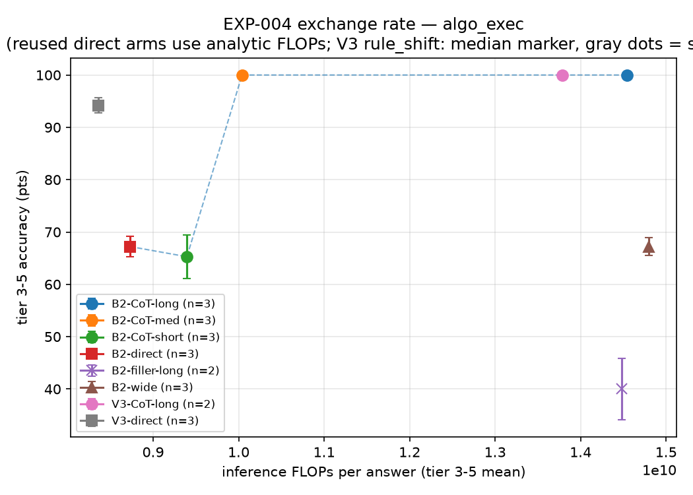
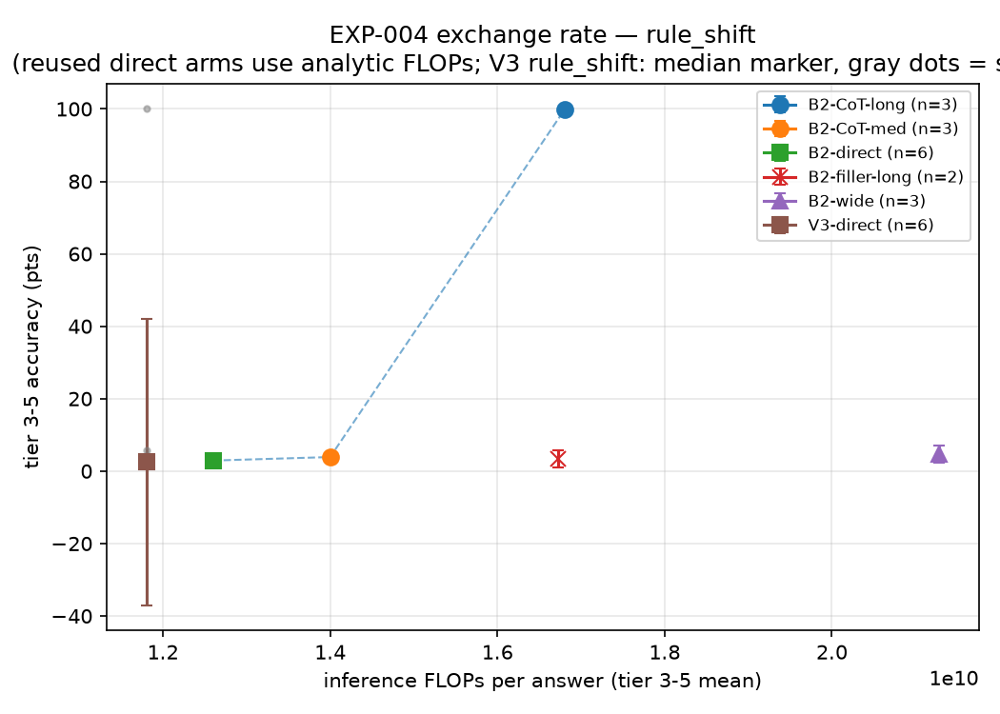

# Arc 2 — The economics of thinking tokens at 18M parameters

**Mission.** At matched inference FLOPs per answer, which converts compute into
correct answers best: visible chain-of-thought tokens, a bigger model, or
latent fast-weight memory? Every claim below traces to run_ids in
`experiments/results.csv`; margins and gates were pre-registered in
`agent/log/EXP-004.md` / `EXP-009.md` before any training; every generated
token is charged a full forward pass at its context length
(`sage/flops/accounting.py`).

## Headline

**Trained rationale tokens are the best FLOP-to-accuracy converter we tested —
and the win is content, not compute.** At matched per-answer FLOPs, a
Transformer++ that writes a step-by-step trace beats (a) itself answering
directly, (b) a 1.7x-larger model spending the same FLOPs on width, and (c)
the V3 delta-memory hybrid's latent computation. The exception proves the
mechanism: traces that are too sparse (every-3rd-value checkpoints) or
contentless (length-matched filler dots) pay nothing or hurt.

## Design (4+2 arms x 2 families, tier 3-5 primary, 3 seeds unless noted)

18M Transformer++ (B2) trained per-family for 4000 steps; CoT arms train on
`THINK:\n<trace>\nANSWER:` supervision with the trace *granularity* as the
budget knob (eval-time truncation is an invalid instrument — a truncated
trace never reaches `ANSWER:`). Scoring greedy, final-answer-only;
format-failure rate logged (it was 0.00 everywhere). B2-wide (30.76M, d672)
was sized analytically so its direct per-answer FLOPs match B2-CoT-long
within 1.8% on algo_exec. B2/V3 direct arms reused from EXP-002 (declared
pre-launch; generator prompt/answer byte-identity enforced by test).

## Exchange-rate curves

### algo_exec (serial program execution), tier 3-5 accuracy vs FLOPs/answer

| arm | acc | fpa (x direct) |
|---|---|---|
| B2 direct | 67.2 | 1.00 |
| V3 direct | 94.2 | 0.96 |
| B2-CoT-short | 65.3 | 1.08 |
| **B2-CoT-med** | **100.0** | **1.15** |
| B2-CoT-long | 100.0 | 1.66 |
| B2-filler-long | 40.0 | 1.66 |
| B2-wide (30.76M) | 67.2 | 1.70 |
| **V3-CoT-long** | **100.0** | **1.58** |

### rule_shift (in-context rule adaptation)

| arm | acc (median for V3) | fpa (x direct) |
|---|---|---|
| B2 direct | 2.9 | 1.00 |
| V3 direct | 2.5 (bimodal: 1/6 seeds at 100) | 0.94 |
| B2-CoT-med (query-only trace) | 3.9 | 1.11 |
| **B2-CoT-long (full-table trace)** | **99.7** | **1.33** |
| B2-filler-long | 3.3 | 1.33 |
| B2-wide | 4.7 | 1.69 |

## The four pre-registered gates (all margins +3.0, > 2x pooled seed SD)

1. **Does CoT pay? PASS on both families.** +32.8 (algo_exec, med budget) and
   +96.8 (rule_shift, long budget) over direct.
2. **Content or compute? Content.** Filler tokens (same length, same FLOPs)
   are null on rule_shift (+0.4) and *negative* on algo_exec (-27.2). There is
   no pause-token free lunch here; burning decode FLOPs without content
   actively degrades the model that was trained to use them.
3. **Tokens or params at matched FLOPs? Tokens, decisively.** The 30.76M
   B2-wide bought +0.0 on algo_exec and +1.8 on rule_shift over 17.8M B2;
   CoT beats it by +32.8 / +95.0 at the same per-answer cost.
4. **Latent vs visible? Visible wins accuracy; the crossover is cheap.**
   V3-direct (94.2) holds a 27-pt edge over B2-direct at 0.96x cost, but
   B2-CoT-med passes it (100.0) at only 1.20x V3's FLOPs. On rule_shift the
   contrast is starker: the full-table trace converts a 1-in-6 grokking
   lottery into 99.7 on every seed — visible reasoning buys *reliability*,
   not just accuracy.

**Stacking addendum:** V3-CoT-long = 100.0 on all tiers, both seeds, at ~5%
lower cost than B2-CoT-long. Latent memory and visible traces compose; at
this scale the trace does the heavy lifting and the delta layers trim cost.

## Curve-shape findings (not pre-registered, descriptive)

- **Accuracy is non-monotone in trace budget.** Sparse value-checkpoint
  traces (CoT-short, 65.3) sit at/below direct: a trace that skips steps
  forces the model to bridge gaps silently, which is exactly the hard part.
  The full step-by-step trace is qualitatively different work.
- **Trace semantics matter more than length** on rule_shift: the query-only
  trace (med, 47 tok) is ~direct; reconstructing the *current rule table*
  first (long, 116 tok) solves the family. The winning trace externalizes the
  latent state the direct model fails to track.
- The FLOP axis spans only 1.0-1.7x direct because prefill dominates at these
  prompt shapes — thinking tokens are nearly free here, which itself is a
  deployment-relevant observation (short-prompt regimes price CoT very low).

## Side-study: grokking predictor (EXP-009, negative at the bar)

16 fresh instrumented V2-delta seeds on rule_shift: **3/16 grokked** (Wilson
95% CI [.07, .43], consistent with the prior 1/6), 2 more caught
mid-transition at the 4000-step budget end, 11 flat. Probe-crossing onsets
span steps 1000-2600. A same-seed re-run of the original grokked seed reached
only .695 — onset is trajectory-sensitive, not seed-determined. **No
first-1000-step signal met the pre-registered predictor bar** (the k=2
delta-state-norm separation broke at k=3). Directional trends (lower state
norm, higher effective rank, earlier tier-1 lift in grokked runs) are logged
as hypothesis-generating only. Full data: `experiments/exp009_diag/`,
`reports/figs/exp009_grok_signals.png`.

Reframe for arc 3: with 5/16 runs in or through the transition by step 4000,
"does it grok" may reduce to "how fast" — extending flat seeds past 4000
steps (warm-starting from retained checkpoints) is the cheap falsifier.

## Honest limits

- Trace supervision is task-aligned and in-distribution; this measures the
  economics of *trained, correct* rationales, not prompted or noisy ones.
- Greedy decoding only; no sampling, self-consistency, or search.
- 18M-30M params, procedural benchmark, per-family training, 2-6 seeds/arm.
- B2-wide used a probed lr (3.7e-4, decided pre-eval) but no full tune; its
  null could understate a well-tuned wide model by a few points — not by 33.
- The all-arms accounting includes the training-side asymmetry: CoT arms train
  on longer sequences (more training FLOPs at equal steps). The claim is
  scoped to inference-time economics, as pre-registered.

## Run provenance

- EXP-004-AX / EXP-004-RS: session C (canonical; session A's identical runs
  were stranded by an infra failure and are excluded — deviation logged
  before per-tier results existed; A-vs-C all-tier cross-check agreed
  arm-for-arm). V3-CoT-long: session B.
- EXP-009: seeds 14-29 (sessions C+B), s2 bonus re-run session B; seeds 6-13
  stranded with session A, dropped pre-outcome.
- Reused arms: EXP-002-AX / EXP-002-RS (run_ids in agent/log/EXP-004.md).
- Cost: ~$21 across 3 sessions (incl. ~$4.5 lost to the session-A stranding).
